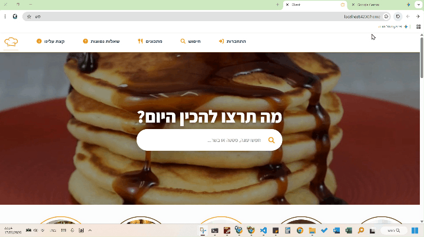

# 🍲 Recipe Sharing Platform

A production-style Full Stack web application built with Flask and Angular, featuring role-based access control, a smart ingredient-matching algorithm, and dynamic image processing.
This project demonstrates backend architecture beyond basic CRUD operations, including algorithmic ranking logic, ORM-based modeling, permission enforcement, and structured file handling.

-------------------------------------------------------------------------------

-------------------------------------------------------------------------------

## 🚀 Project Overview
The platform enables users to:
* Discover recipes dynamically
* Search recipes based on available ingredients
* Upload recipes with automatic image variations
* Manage personal content through role-based permissions

The backend follows an ORM-driven architecture using SQLAlchemy, applying object-oriented principles and model inheritance. The frontend is built with Angular using a modular component-based structure.

## 🛠 Tech Stack 

**Backend**
* Python 3.13
* Flask
* SQLAlchemy (ORM)
* SQLite
* Pillow (image processing)
* RESTful API design

**Frontend**
* Angular
* TypeScript
* Component-based architecture
* Dynamic filtering & sorting

## ✨ Key Features 

### 🔍 Smart Ingredient Matching Algorithm
Users can enter the ingredients they have available.
The backend:
* Converts ingredient lists into Python sets
* Computes intersection between user ingredients and recipe ingredients
* Calculates a matching score: Matching Score = (Number of matching ingredients) / (Total required ingredients)
* Filters low-relevance results
* Sorts recipes by descending relevance score

This ensures users see recipes requiring minimal additional purchases.

-------------------------------------------------------------------------------

-------------------------------------------------------------------------------

### 🖼 Advanced Image Processing Pipeline
When a recipe image is uploaded:
The original image is saved
Three additional variations are generated automatically using Pillow:
1. Black & White
2. Rotated
3. Cropped / Modified effect

All variation paths are stored in the database (JSON/string format).
This creates a dynamic gallery experience per recipe.

-------------------------------------------------------------------------------

-------------------------------------------------------------------------------

### 👥 Role-Based Access Control
The system includes three user roles:
* Reader – browse, search, and rate recipes
* Uploader – add new recipes (after admin approval)
* Admin – approve uploaders, delete recipes, manage users

All protected routes are enforced using server-side decorators.

### 🗂 Database Architecture
ORM-based models:
* BaseModel – shared ID and save logic (inheritance-based design)
* User – authentication, roles, approval status
* Recipe – metadata, image paths, recipe type
* IngredientEntry – One-to-Many relationship with Recipe

Relational integrity and object mapping are handled via SQLAlchemy.

## 📥 Installation & Setup 

### 1️⃣ Clone the Repository 

    git clone [https://github.com/saraKatzen/recipe-sharing-platform.git](https://github.com/saraKatzen/recipe-sharing-platform.git) 
    cd recipe-sharing-platform 

### 🔧 Backend Setup (Flask) 
Create Virtual Environment:

    cd backend 
    python -m venv .venv 

Activate Environment (Windows):

    .venv\Scripts\activate 

Install Dependencies & Run the Server:

    pip install -r requirements.txt 
    py -3.13 app.py

Backend runs on: http://localhost:5000

### 💻 Frontend Setup (Angular)
Open a new terminal:

    cd frontend 
    npm install 
    ng serve

Frontend runs on: http://localhost:4200

## 🗄 Database
Database: SQLite
The database file is created automatically on first run (if not present).

## 🔐 Security & Architecture Highlights
* Server-side role validation decorators
* Controlled uploader approval workflow
* Structured image storage organization
* JSON-based field persistence
* Separation between frontend and backend layers
* Clean OOP model inheritance

## 🎯 What This Project Demonstrates
* Full Stack architecture
* Backend logic beyond CRUD
* Algorithmic thinking
* Structured database modeling
* Role-based permission systems
* File handling & image processing
* RESTful API design principles
